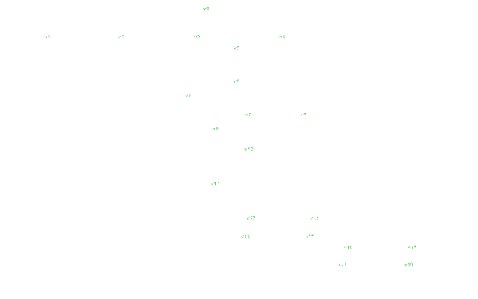

# PMC2259313

## image

NOTE. This is a vector diagram and could be extracted from SVG. The PNG image on the publisher site is poor

## pathway value
medium

## semantic feasibility 
high

## technical quality
high if PDF used
low: antialiasing, small fonts, colours badly grey, small blurred

## score/10
4 image
8 for vectors

## interesting channels

### 5fd063
green annotation (numbers) badly antialiased (look very carefully - they are there!)

