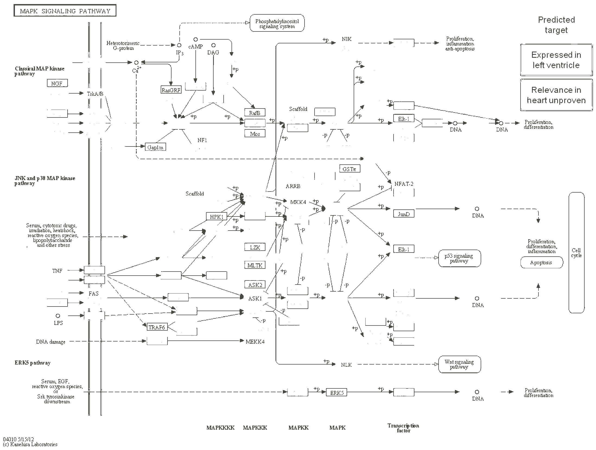

# PMC3683050

## image

## pathway value
medium

## semantic feasibility 
high

## technical quality
low
bad antialiasing, font size

## score/10
4 
Quality is too low to make it interesting for me
## interesting channels

### 464a43
main links between nodes

### d3df55
annotation colours

### d71c15
box edge colours

