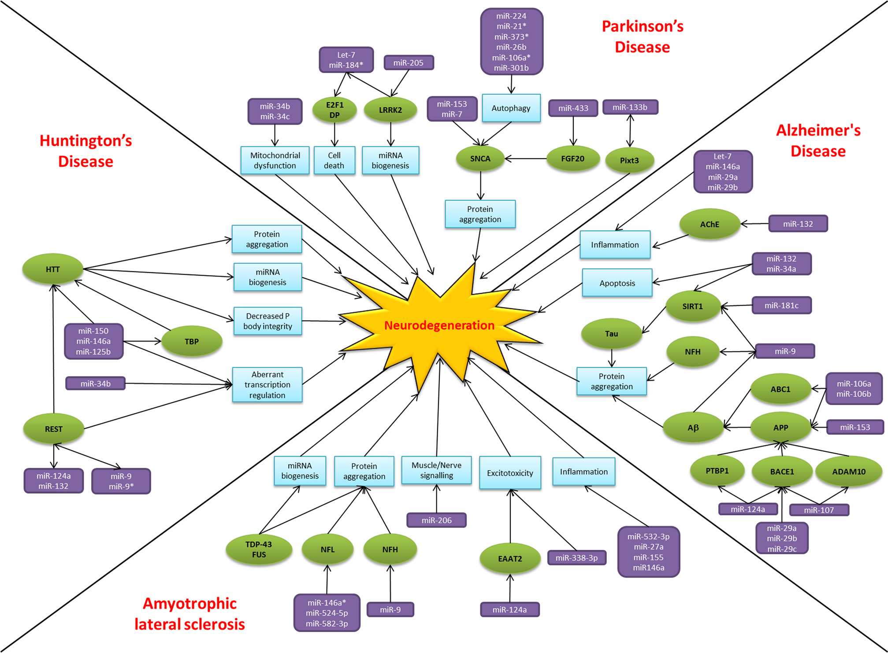
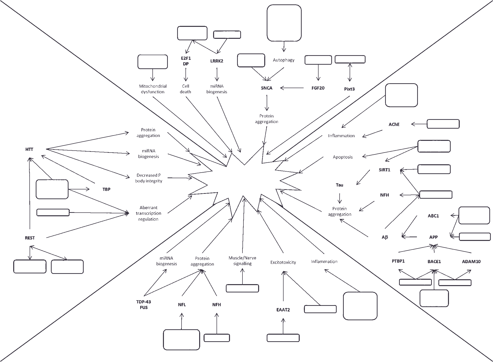
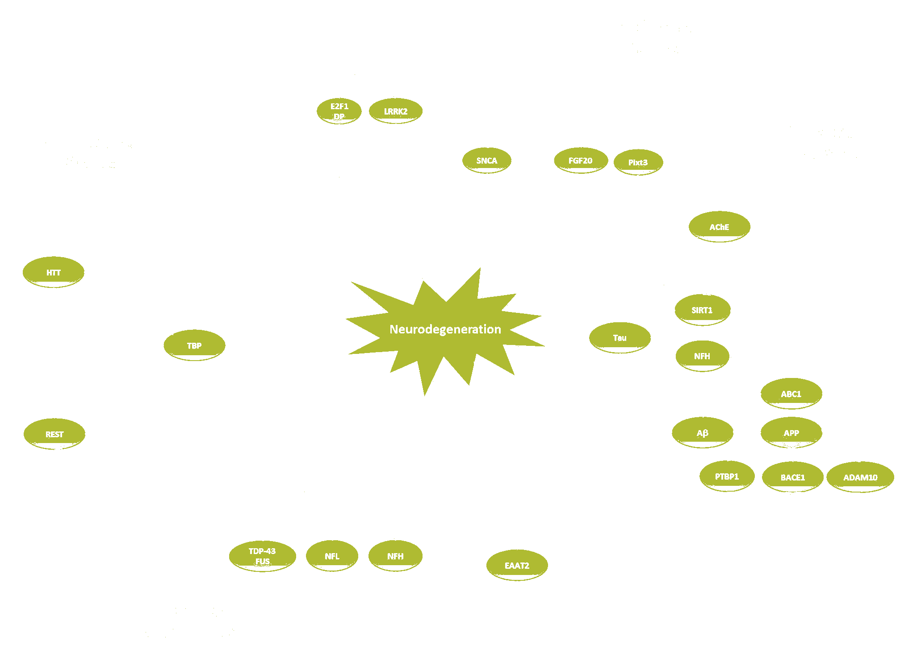
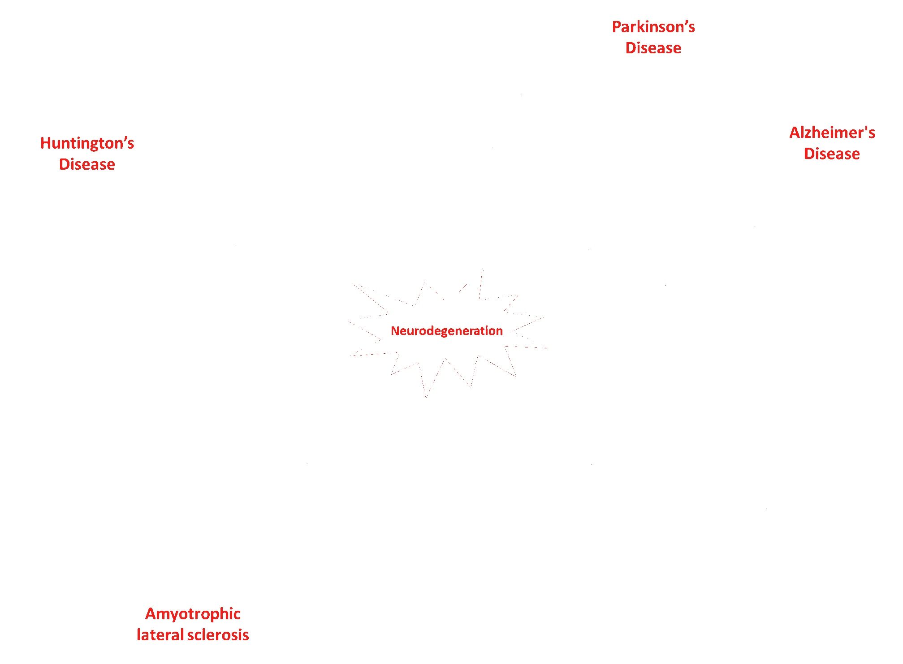

# PMC

## image

## pathway value
medium

## semantic feasibility 
high

## technical quality
medium (too much gradient)

## score/10
4

## interesting channels

### 36313e
main structure, well preserved

### afbb32
octree flattened because of gradients. Might be recoverable

### f91b15
red labels, well separated

