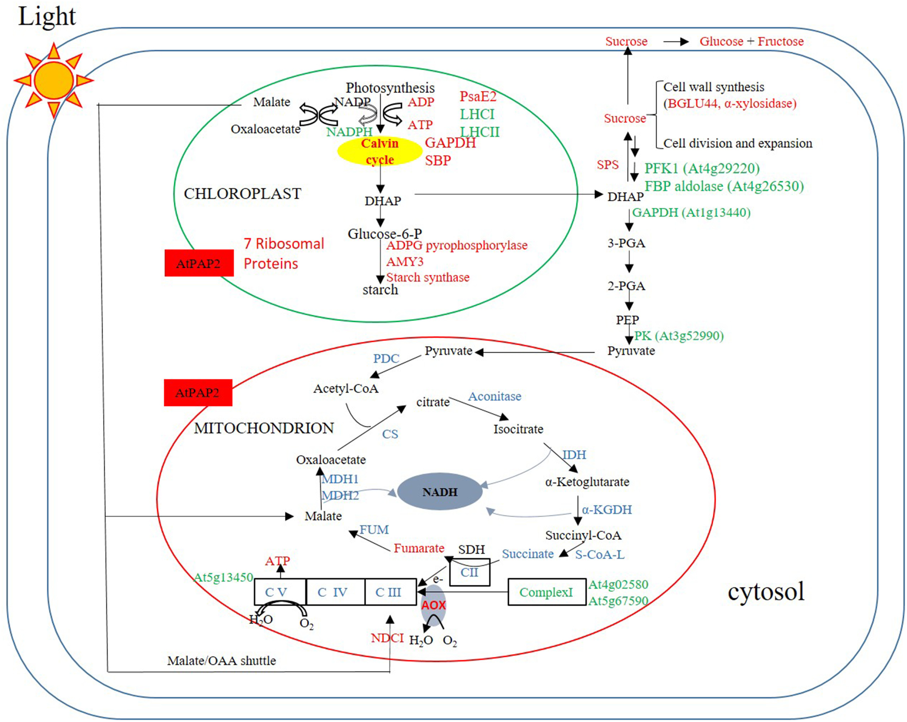

# PMC4623399

## image

<kbd></kbd>

## pathway value

## semantic feasibility 

## technical quality

## score/10

## interesting channels

### 373539
most of the structure
<kbd></kbd>

### e02725
the red components
<kbd></kbd>

### f1b725
the orange components
<kbd></kbd>
